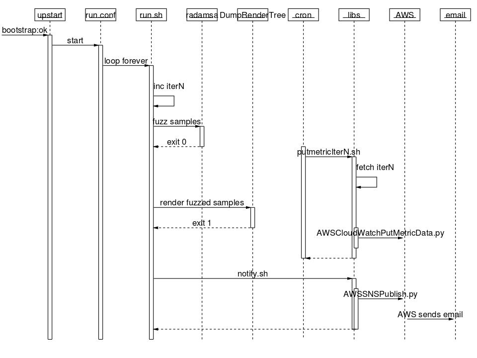

# Code walkthrough
cloudrun consists of a collection of small shell scripts, python scripts, upstart jobs conf files and other configuration files.

Each script file is kept very short by design, so that they can be replaced or repurposed easily.

The scripts in the libs directory, are all generic and deal mainly with interaction with AWS services.

cloudrun executes a *task*, which is defined as a:
 * *`bootstrap.sh`*, sets the environment up
 * *`run.sh`*, main execution loop
 * *`taskenv.sh`*, environment variables for the task

## Bootstrap
The startup sequence, consists of the following steps.
### cloudinit specific
_Note:_ Some details ommited, see [cloudinit docs](https://help.ubuntu.com/community/CloudInit) for full details
 * unpack the initialisation file and run it through the *`part-handler.py`* script
 * mount filesystems specified in *cloud-config.txt*
 * execute bootcmd section of *cloud-config.txt*
 * install the extra packages specified in the *cloud-config.txt*

###cloudrun specific
Once cloudinit has finished, it hands other to the cloudrun scripts.
Specifically this is accomplished by waiting on completion of the "cloud-final" upstart job.

The cloudrun upstart job: *`bootstrap.conf`* then starts and calls *`bootstrap.sh`*.

*`bootstrap.sh`* calls: *`libs/AWSS3GenURL.py`*, which generate an AWS S3 signed ["requester pay" URL](http://docs.amazonwebservices.com/AmazonDevPay/latest/DevPayDeveloperGuide/S3RequesterPays.html) to *`DumpRenderTree`*.

*`bootstrap.sh`* hands this URL over to *`wget`*, which fetches *`DumpRenderTree`*.

*`bootstrap.sh`* then fetches *`radamsa`* and the file samples (png or CSS), then unpacks the binaries and tests that they can start ok.

Finally *`bootstrap.sh`*, schedules a *`cron`* job, that periodically upload the cloudrun metric(s) to AWS CloudWatch.

_Note:_ a 3rd upstart job: *`Xvfbd.conf`* starts [Xvfb](http://en.wikipedia.org/wiki/Xvfb), which is needed by DumpRenderTree.

## Main Execution loop

On successful completion of the *bootstrap upstart job*, the *run upstart job* starts, which call *`run.sh`* with args: `loop forever`.

This repeatedly 
 * calls *`radamsa`* to generate a new batch of fuzzed files
 * calls *`DumpRenderTree`* to render the fuzzed file
 * if a crash is detected, calls *`libs/notify.sh`*, which in turn calls *`libs/AWSSNSPublish.py`* to publish the message to AWS Simple Notification Service.

In the background, the cron job periodically schedules *`libs/putmetricIterN.sh`*, which:
 * Read *`/tmp/iterN`*, the running counter kept by *`run.sh`*
 * Convert it to a Time Series with *`lib/cnt2TS.sh`*
 * Calls *`AWSCloudWatchPutMetricData.py`* to post it to AWS CloudWatch

Sequence diagrams generated with [umlgraph](http://www.umlgraph.org/)
